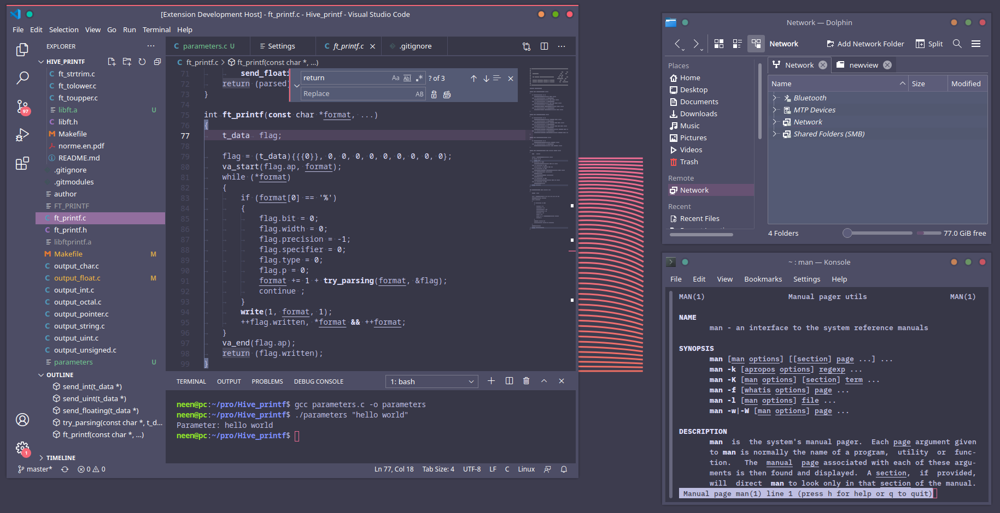

[//]: # (`Shift+CMD+V` on macOS or `Shift+Ctrl+V` on Windows and Linux)
[//]: # (http://code.visualstudio.com/docs/languages/markdown)
[//]: # (https://help.github.com/articles/markdown-basics/)

# Credits & Honorable mentions
* Phob1an — Modernity — The theme Nightlight is intended to blend with.
* David Perkins — Purrp! Theme — Some elements use colors based on this.

# Screenshots
